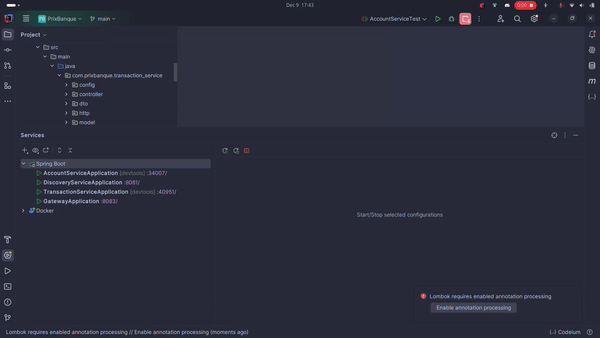
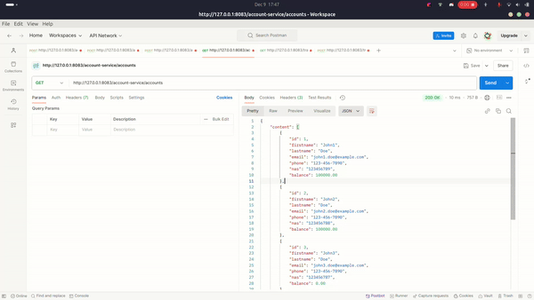
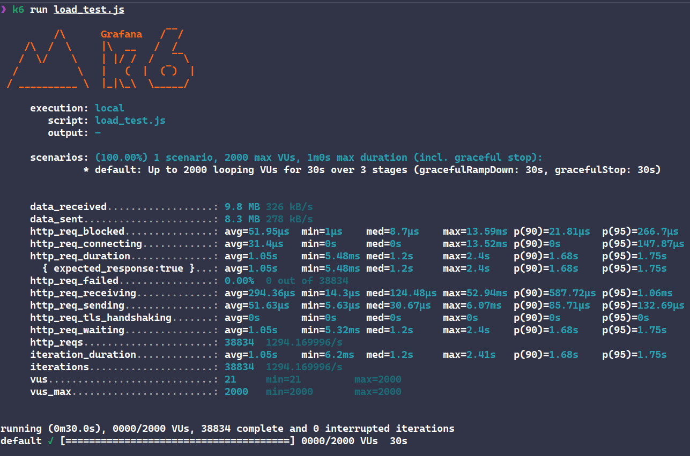

# Prix Banque

### Executer en local

Lancer la base de données:

```bash
docker compose up -d
```

Lancer les services dans l'ordre suivant:
- `discovery-service`
- `gateway`
- `account-service`
- `transaction-service`
- `invoice-service`

### Démo



